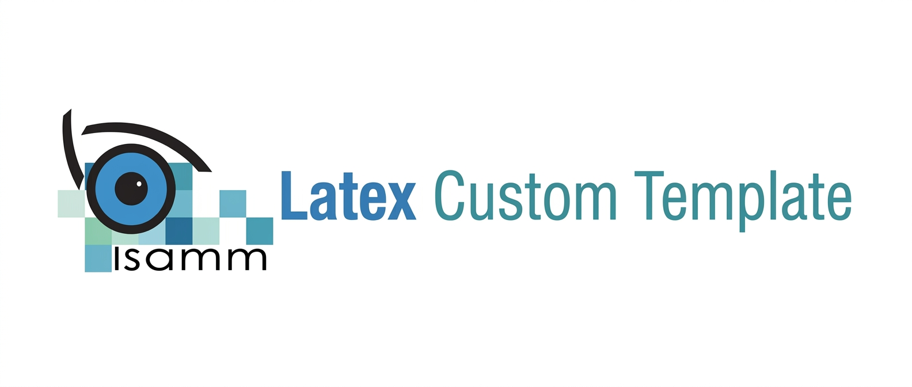

<p align="center">
  
</p>

<p align="center">
  <a href="LICENSE"></a>
  
  <a href="CODE_OF_CONDUCT.md"></a>
  <a href="CONTRIBUTING.md"></a>
</p>

# Report Template

A LaTeX template for academic reports. Fork it, swap in your own content,
and start writing instead of fighting with formatting. It compiles out of
the box and covers the parts most reports need: a title page, front
matter, numbered chapters, a bibliography, and an appendix.

## Why use this

Setting up a report from scratch in LaTeX takes longer than it should.
package conflicts, missing files, inconsistent formatting. This template
skips that part: clone it, replace the placeholder text, compile.

## Structure

The document is organized as a master file that assembles individual content files:

```
.
├── `Main.tex`                    # Master file that compiles the entire document
├── `garde_fin.tex`               # Title page and cover
├── `Dedicaces.tex`               # Dedications
├── `Remerciements.tex`           # Acknowledgements
├── `Introduction.tex`            # General introduction
├── `Chapter1.tex`                # Chapter 1: Project Context
├── `Chapter2.tex`                # Chapter 2: Requirements Analysis
├── `Chapter3.tex`                # Chapter 3: Modeling
├── `Chapter4.tex`                # Chapter 4: Implementation
├── `Conclusion.tex`              # General conclusion
├── `Acro.tex`                    # Acronyms list
├── `bibliography.bib`            # Bibliography (BibTeX format)
├── `setspace.sty`                # Custom styling package
├── Figures/                    # Images and diagrams
│   ├── banner.jpg
│   ├── logo-isamm.jpeg
│   └── logo.png
└── `README.md`                   # This file
```

Open `Main.tex` to see how files are included and to understand the complete document flow. Each `.tex` file contains a single section or chapter, making it easy to edit and manage content independently.

## Getting started

### Option 1: Overleaf

1. Create a new project and upload this repository's contents (or import
   it directly from GitHub).
2. Set the main file to the entry point listed in `Main.tex`.
3. Click Compile.

### Option 2: Local build

You'll need a LaTeX distribution (TeX Live, MiKTeX, or similar) with
support for the language packages the template uses.

```bash
latexmk -pdf Main.tex
```

Without `latexmk`:

```bash
pdflatex Main.tex
bibtex Main
pdflatex Main.tex
pdflatex Main.tex
```

## Customizing

- **Title page**: update the title, author, supervisors, and date.
- **Logo**: swap the placeholder image for your institution's or
  organization's logo.
- **Chapters**: add, remove, or rename chapter files as needed, then
  update the `\include{...}` list in the main file to match.
- **Bibliography**: add entries to the `.bib` file in standard BibTeX
  format and cite them with `\cite{key}`.
- **Styling**: fonts, margins, colors, and header/footer formatting are
  set near the top of the main file.

## Contributing

Contributions are welcome, see [CONTRIBUTING.md](CONTRIBUTING.md) for
how to report issues or submit changes. Please also read the
[Code of Conduct](CODE_OF_CONDUCT.md) before participating.

## License

Distributed under the MIT License. See [LICENSE](LICENSE) for details.